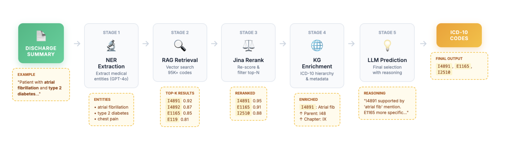
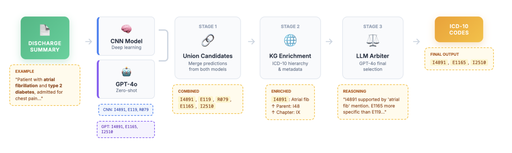

# Automated ICD-10 Coding from Clinical Discharge Summaries

**Authors:** Ankit Pal, Benet Fité Abril, Yunxi Li  
**Institution:** Harvard Medical School, BMIF 204

---

## 📁 Repository Structure

```
bmif_full_model/
├── cnn/                           # CNN training and evaluation
│   ├── train_full_codes.py        # Train CNN on all ICD-10 codes
│   ├── eval_cnn.py                # Evaluate trained CNN
│   └── evaluate_model.py          # Model evaluation utilities
│
├── llm_eval/                      # LLM evaluation
│   ├── llm_evaluate_results.py    # Evaluate LLMs (GPT-4o, Claude, etc.)
│   └── llm_call_api.py            # LLM API wrapper
│
├── rag/                           # RAG pipeline
│   ├── rag_icd10_pipeline.py      # Main RAG pipeline
│   ├── rag_icd10_retriever.py     # Vector similarity retrieval
│   ├── rag_llm_predictor.py       # LLM prediction stage
│   ├── ner_disease_extractor.py   # NER extraction
│   └── icd10_vector_index_builder.py  # Build FAISS index
│
├── ensemble/                      # Ensemble arbiter
│   ├── create_ensemble_dataset.py # Create ensemble candidates
│   └── ensemble_llm_arbiter.py    # LLM arbiter for code selection
│
├── utils/                         # Shared utilities
│   ├── constants.py               # Constants and paths
│   ├── evaluation.py              # Metrics calculation
│   ├── datasets.py                # Dataset loaders
│   ├── icd10.py                   # ICD-10 utilities
│   ├── persistence.py             # Save/load functions
│   └── calculate_all_metrics.py   # Comprehensive metrics
│
├── configs/                       # Configuration files
│   ├── cnn_config.yaml            # CNN hyperparameters
│   ├── rag_config.yaml            # RAG pipeline settings
│   ├── ensemble_config.yaml       # Ensemble arbiter settings
│   └── llm_eval_config.yaml       # LLM evaluation config
│
├── data/                          # Data directory
│   └── mimic4_icd10/              # Processed MIMIC-IV data
│
├── models/                        # Saved models
├── results/                       # Evaluation results
├── notebooks/                     # Jupyter notebooks
├── model-dashboard/               # Interactive visualization
└── README.md                      # This file
```

---

## 🔬 Evaluated Approaches

We compared four distinct approaches across three paradigms:

### 1. Zero-Shot Large Language Models
Seven state-of-the-art LLMs (GPT-4o, GPT-5 Mini, Claude 3.7 Sonnet, Claude 4.5 Haiku, Gemini 2.0 Flash, Qwen 30B, DeepSeek V3) with identical prompts. No training examples or fine-tuning.

### 2. Convolutional Attention Network (CAML)
- 100-dim word embeddings, 50 conv filters (kernel size 4)
- Label-specific attention for ~27,000 ICD-10 codes
- Trained 40 epochs (~10-12 hours on A100 GPU)


### 3. Retrieval-Augmented Generation (RAG)
Four-stage pipeline for rare codes:
1. LLM-based NER extraction
2. Vector similarity search (FAISS, 95K+ ICD-10 codes)
3. ICD-10 knowledge graph enrichment
4. LLM final selection with reasoning



### 4. Ensemble Arbiter System
Meta-model combining CNN + GPT-4o:
1. Collect independent predictions
2. Union candidate codes
3. ICD-10 knowledge graph validation
4. LLM arbiter selects final codes



---

## 📋 Complete Workflow Overview

### Data Pipeline from MIMIC-IV to Final Results

```
1. MIMIC-IV Data (PhysioNet)
   ├─ hosp/diagnoses_icd.csv (diagnosis codes)
   ├─ note/discharge.csv (discharge summaries)
   └─ hosp/patients.csv, admissions.csv (demographics)
   ↓
2. Process & Create Splits (notebooks/data_mimic_IV_concat_note_label.py)
   - Concatenate notes with labels
   - Filter ICD-10 codes only
   → train.csv, test.csv, dev.csv
   ↓
3. Create Stratified Sample (create_llm_eval_sample.py)
   - Stratified sampling: 100 samples per stratum (9 strata total)
   - Code frequency tiers: common (top 0.1%), medium (0.1-1%), rare (99%)
   - Text length tiers: short, medium, long (33rd/67th percentiles)
   → llm_eval_900_sample.csv
   ↓
4. Enrich with Clinical Metadata (../enrich_evaluation_data.py)
   - Join with MIMIC tables (patients, admissions, diagnoses)
   - Add demographics, comorbidity burden, admission context
   → llm_eval_900_enriched.csv (PROVIDED - skip steps 1-4 to reproduce)
   ↓
5a. Train/Evaluate CNN Model              5b. Evaluate LLM Models
    → convnet_predictions_900.json            → gpt-4o_intermediate.json
    ↓                                         ↓
    └─────────────────┬──────────────────────┘
                      ↓
6. Create Ensemble Dataset (ensemble/create_ensemble_dataset.py)
   - Combines CNN + LLM predictions
   - Validates codes against ICD-10 knowledge graph (filters ~10-15% invalid)
   - Enriches with hierarchy data (parents, children, descriptions)
   → ensemble_dataset_900.csv + ensemble_dataset_900.json
   ↓
7. Run Ensemble Arbiter (ensemble/ensemble_llm_arbiter.py)
   - LLM selects final codes using clinical reasoning + KG context
   → gpt-4o_arbiter_results.json
   ↓
8. Calculate Metrics (utils/calculate_all_metrics.py)
   - Overall + stratified metrics (code freq, length, comorbidity, race)
   → all_metrics_summary.json
   ↓
9. Visualize Results (model-dashboard/)
   → Interactive dashboard at localhost:6611
```

**Key Points:**
- **Steps 1-4**: Data preparation (one-time setup, **SKIP if using provided dataset**)
- **Step 4**: Evaluation dataset `llm_eval_900_enriched.csv` is **PROVIDED**
- **Steps 5-6**: Model predictions are combined and validated against ICD-10 KG
- **Step 7**: Final LLM arbiter makes ensemble decisions with hierarchy awareness
- **Steps 8-9**: Comprehensive metrics and visualization

---

## 🚀 Quick Start
### 1. Environment Setup

#### Option A: Linux/Windows with NVIDIA GPU

```bash
# Create conda environment
conda create -n icd10_coding python=3.10
conda activate icd10_coding

# Install PyTorch with CUDA support
pip install torch torchvision torchaudio --index-url https://download.pytorch.org/whl/cu118

# Install other dependencies
pip install numpy pandas scikit-learn tqdm pyyaml
pip install openai anthropic google-generativeai litellm
pip install faiss-cpu llama-index nltk spacy gensim
pip install jupyter matplotlib seaborn

# Download spaCy model
python -m spacy download en_core_web_sm
```

#### Option B: macOS (Intel or Apple Silicon)

```bash
# Create conda environment
conda create -n icd10_coding python=3.10
conda activate icd10_coding

# Install PyTorch for macOS (CPU or MPS for Apple Silicon)
./install_pytorch_macos.sh
# OR manually:
pip install torch torchvision torchaudio

# Install other dependencies
pip install numpy pandas scikit-learn tqdm pyyaml
pip install openai anthropic google-generativeai litellm
pip install faiss-cpu llama-index nltk spacy gensim
pip install jupyter matplotlib seaborn

# Download spaCy model
python -m spacy download en_core_web_sm
```

**⚠️ Important for macOS Users:**
- macOS does not support CUDA (NVIDIA GPUs)
- Remove `--gpu` flag from all training commands
- Apple Silicon (M1/M2/M3) can use MPS for GPU acceleration
- CPU training is much slower (~2-3 days vs 10-12 hours on GPU)
- **Recommendation:** Use the pretrained model for evaluation instead of training from scratch

### 2. Data Preparation

#### Step 1: Obtain MIMIC-IV Data

**You must have PhysioNet credentials and complete the required training to access MIMIC-IV.**

1. **Apply for access:**
   - Go to https://physionet.org/content/mimiciv/2.2/
   - Complete required training (CITI "Data or Specimens Only Research")
   - Sign data use agreement (DUA)
   - Wait for approval (~1-2 weeks)

2. **Download MIMIC-IV v2.2:**
   ```bash
   # Create directory
   mkdir -p mimicdata/physionet.org/files/mimiciv/2.2
   
   # Download using wget or the PhysioNet download tool
   wget -r -N -c -np --user YOUR_USERNAME --ask-password \
     https://physionet.org/files/mimiciv/2.2/ \
     -P mimicdata/
   ```

3. **Required files:**
   - `hosp/diagnoses_icd.csv` - ICD-10 diagnosis codes
   - `note/discharge.csv` - Discharge summaries
   - Extract and place in `mimicdata/physionet.org/files/mimiciv/2.2/`

#### Step 2: Process MIMIC-IV Data

**Generate train/test/dev splits from raw MIMIC-IV data:**

```bash
# Run data preprocessing notebook/script
cd notebooks
python data_mimic_IV_concat_note_label.py

# This creates:
# - mimicdata/mimic4_icd10/train.csv
# - mimicdata/mimic4_icd10/test.csv
# - mimicdata/mimic4_icd10/dev.csv
```

**What this does:**
- Concatenates discharge summaries with ICD-10 codes
- Filters for ICD-10 codes only (MIMIC-IV uses both ICD-9 and ICD-10)
- Creates stratified train/test/dev splits
- Formats: `subject_id, hadm_id, text, labels`

#### Step 3: Create Stratified Sample (Optional - Already Provided)

**Run stratified sampling script to select 900 samples:**

```bash
python create_llm_eval_sample.py \
  --input mimicdata/mimic4_icd10/full_code/test_full.csv \
  --output llm_eval_900_sample.csv \
  --seed 42
```

**What `create_llm_eval_sample.py` does:**
- **Calculates code frequencies** from training set to determine rarity
- **Classifies test samples** into stratification tiers:
  - **Code Frequency**: common (top 0.1%), medium (0.1-1%), rare (99%)
  - **Text Length**: short/medium/long (33rd/67th percentiles)
- **Samples 100 records per stratum** (9 strata = 900 total)
- **Ensures balanced evaluation** across difficulty levels

**Output:** `llm_eval_900_sample.csv` with columns:
```csv
sample_id, hadm_id, text, labels,
length, length_tier,                  # Text length stratification
code_frequency_tier, num_codes,       # Code frequency stratification
stratification_group                  # Combined group label (e.g., "common_short")
```

**Stratification Distribution:**
```
                Short    Medium    Long    Total
Common          100      100      100      300
Medium          100      100      100      300  
Rare            100      100      100      300
Total           300      300      300      900
```

#### Step 4: Enrich with Clinical Metadata (Optional - Already Provided)

**Run enrichment script to add clinical metadata:**

```bash
# Run from parent directory
cd /path/to/bmif_final
python enrich_evaluation_data.py
```

**What `enrich_evaluation_data.py` does:**
- Joins `llm_eval_900_sample.csv` with MIMIC-IV tables:
  - `patients.csv` → demographics (age, gender)
  - `admissions.csv` → admission context, race, insurance, LOS
  - `diagnoses_icd.csv` → comorbidity count
- Calculates **comorbidity burden** tiers (low/medium/high: 1-5, 6-10, 11+ codes)
- Categorizes **demographics** (age groups, race/ethnicity)
- Adds **admission context** (emergency vs elective - proxy for documentation quality)
- Computes **clinical outcomes** (length of stay, mortality)

**Final enriched columns:**
```csv
sample_id, hadm_id, text, labels,
gender, age_group, race_group,                    # Demographics
admission_context, is_emergency,                  # Admission type
num_comorbidities, comorbidity_tier,              # Disease complexity
length_tier, code_frequency_tier,                 # Task difficulty
insurance_group, los_group, mortality, ...        # Additional metadata
```

**Output:** `llm_eval_900_enriched.csv`

---

#### ⚠️ Important: Provided Dataset (Skip Steps 1-4)

**You can skip Steps 1-4** if you only want to reproduce our results:

✅ **Provided file:** `llm_eval_900_enriched.csv` is **ready to use**  
✅ Contains all stratification + clinical metadata  
✅ Start directly with model evaluation  

**Only need Steps 1-4 if you want to:**
- Train models from scratch on your own data
- Create a different stratified sample (e.g., 1000 samples)
- Use updated MIMIC-IV versions
- Modify stratification criteria

**Dataset characteristics:**
- 900 stratified samples from MIMIC-IV test set
- Balanced across **9 strata** (3 code frequencies × 3 text lengths)
- Rich **clinical metadata** for subgroup analysis
- Enables **fairness analysis** (race, gender, admission context, comorbidity)

### 3. Set API Keys

```bash
# Create .env file with API keys
echo "OPENAI_API_KEY=sk-your-key-here" > .env
echo "ANTHROPIC_API_KEY=sk-ant-your-key-here" >> .env
echo "GOOGLE_API_KEY=your-key-here" >> .env
```

---

## 🔧 How to Run Each Component

---

## 1️⃣ CNN Training and Evaluation

### Train CNN on All ICD-10 Codes

#### For Linux/Windows with GPU:

```bash
# Train from scratch (10-12 hours on A100 GPU)
python cnn/train_full_codes.py \
    --model conv_attn \
    --n-epochs 50 \
    --batch-size 16 \
    --lr 0.001 \
    --dropout 0.5 \
    --patience 5 \
    --criterion f1_micro \
    --gpu \
    --seed 42
```

#### For macOS (CPU or MPS):

```bash
# Train on CPU/MPS (2-3 days on CPU, ~1 day on MPS)
python cnn/train_full_codes.py \
    --model conv_attn \
    --n-epochs 50 \
    --batch-size 16 \
    --lr 0.001 \
    --dropout 0.5 \
    --patience 5 \
    --criterion f1_micro \
    --seed 42
# Note: NO --gpu flag for macOS!
```

**Parameters:**
- `--model conv_attn`: Convolutional attention architecture (CAML)
- `--n-epochs 50`: Train for maximum 50 epochs
- `--batch-size 16`: Batch size (adjust based on memory)
- `--lr 0.001`: Learning rate
- `--dropout 0.5`: Dropout rate
- `--patience 5`: Early stopping patience (stops if no improvement for 5 epochs)
- `--criterion f1_micro`: Optimization criterion
- `--gpu`: Use GPU acceleration (**Linux/Windows only, remove for macOS**)
- `--seed 42`: Random seed for reproducibility

**Expected Output:**
- Model saved to: `models/conv_attn_<timestamp>/model_best_f1mi.pth`
- Training log: `models/conv_attn_<timestamp>/log_train.txt`
- Metrics: `models/conv_attn_<timestamp>/metrics.json`

**Training Time:**
- **NVIDIA GPU** (A100): ~10-12 hours
- **NVIDIA GPU** (V100): ~15-18 hours
- **Apple Silicon** (M1/M2/M3 with MPS): ~18-24 hours
- **CPU** (Intel/AMD): ~48-72 hours (not recommended)

**💡 Tip for macOS users:** Use the pretrained model instead:
```bash
# Skip training and use pretrained model
python cnn/eval_cnn.py \
    --model-path models/conv_attn_Nov_12_02:00:00/model_best_f1_micro.pth \
    --data-file llm_eval_900_enriched.csv
```

### Evaluate Trained CNN

```bash
# Evaluate on 900-sample stratified test set
python cnn/eval_cnn.py \
    --model-path models/conv_attn_Nov_12_02:00:00/model_best_f1mi.pth \
    --eval-file llm_eval_900_enriched.csv \
    --output-dir results/cnn/

# Or use pretrained model (included)
python cnn/eval_cnn.py \
    --model-path models/conv_attn_Nov_12_02:00:00/model_best_f1mi.pth \
    --eval-file llm_eval_900_enriched.csv \
    --output-dir results/cnn/
```

**Output:**
- `results/cnn/eval_results.json` - Overall metrics
- `results/cnn/predictions.csv` - All predictions
- `results/cnn/stratified_metrics.json` - Performance by strata

---

## 2️⃣ LLM Evaluation

LLM evaluation is a **2-step process**: (1) Call LLM API, (2) Evaluate saved responses

### Step 1: Call LLM API

```bash
# Call a single LLM API
python llm_eval/llm_call_api.py \
    --model gpt-4o \
    --config configs/llm_eval_config.yaml

# Call multiple LLMs
for model in gpt-4o claude-3.7-sonnet gemini-2.0-flash deepseek-v3; do
    python llm_eval/llm_call_api.py \
        --model $model \
        --config configs/llm_eval_config.yaml
done
```

This will save API responses to folders like `llm_eval_results_900/openai_gpt-4o_20241201_103000/`

### Step 2: Evaluate Saved Responses

```bash
# Evaluate results from a specific run (use the folder path shown at end of Step 1)
python llm_eval/llm_evaluate_results.py \
    --folder llm_eval_results_900/openai_gpt-4o_20241201_103000

# Or evaluate all saved results
for folder in llm_eval_results_900/*/; do
    python llm_eval/llm_evaluate_results.py --folder "$folder"
done
```

**Note:** The script will print the exact folder path when Step 1 completes. Use that folder path for Step 2.

**Supported LLMs:**
- `gpt-4o` - OpenAI GPT-4o
- `gpt-5-mini` - OpenAI GPT-5 Mini
- `claude-3.7-sonnet` - Anthropic Claude 3.7 Sonnet
- `claude-haiku-4.5` - Anthropic Claude Haiku 4.5
- `gemini-2.0-flash` - Google Gemini 2.0 Flash
- `qwen-30b` - Alibaba Qwen 30B
- `deepseek-v3` - DeepSeek V3

**Parameters:**
- `--model`: LLM model name (see list above)
- `--config`: Path to config YAML file (contains API keys, dataset path, parameters)

**Cost Estimates (per 900 samples):**
- GPT-4o: ~$30-40
- Claude 3.7 Sonnet: ~$15-20
- Gemini 2.0 Flash: ~$5-10
- Others: ~$5-10 each

**Runtime:** ~30 minutes per model (depends on API rate limits)

**Output:**
- `results/llm_eval/eval_results_<model>.json` - Metrics
- `results/llm_eval/responses_<model>.json` - Full LLM responses
- `results/llm_eval/<model>_predictions.csv` - Predictions

### Batch Evaluation Script

```bash
# Run all LLMs in sequence
./scripts/evaluate_all_llms.sh

# Or parallel (if you have multiple API keys)
./scripts/evaluate_all_llms_parallel.sh
```

---

## 3️⃣ RAG Pipeline

### Build Vector Index (One-Time Setup)

```bash
# Build FAISS index for ICD-10 codes (one-time setup)
python rag/icd10_vector_index_builder.py

# Or with testing to verify the index
python rag/icd10_vector_index_builder.py --test
```

**Output:**
- `icd10_vector_index/` - FAISS index files
- Time: ~10-15 minutes for 95,000 ICD-10 codes

### Run RAG Pipeline

```bash
# Run RAG on rare-code subset (259 samples)
python rag/rag_icd10_pipeline.py \
    --eval-file llm_eval_900_enriched.csv \
    --config configs/rag_config.yaml \
    --rare-only \
    --output-dir results/rag/

# Run RAG on all samples
python rag/rag_icd10_pipeline.py \
    --eval-file llm_eval_900_enriched.csv \
    --config configs/rag_config.yaml \
    --output-dir results/rag/
```

**RAG Pipeline Stages:**
1. **NER Extraction** - Extract medical entities using LLM (GPT-4o)
2. **Vector Retrieval** - Retrieve candidate codes via similarity search
3. **KG Enrichment** - Enrich candidates with ICD-10 hierarchy
4. **LLM Prediction** - Select final codes using LLM reasoning

**Parameters:**
- `--eval-file`: Evaluation dataset
- `--config`: RAG configuration file
- `--rare-only`: Evaluate only on rare-code subset (259 samples)
- `--ner-model`: Model for NER extraction (default: gpt-4o)
- `--prediction-model`: Model for final prediction (default: gpt-4o)
- `--similarity-top-k`: Number of candidates to retrieve (default: 10)
- `--output-dir`: Output directory

**Expected Performance:**
- Rare codes (259 samples): F1-Micro ~16.0%
- All samples (900): F1-Micro ~18-20%

**Runtime:** ~30-45 minutes for 259 rare samples

**Cost:** ~$10-15 for rare subset

**Output:**
- `results/rag/eval_results.json` - Metrics
- `results/rag/ner_extractions.json` - Extracted entities
- `results/rag/retrieved_candidates.json` - Retrieved codes
- `results/rag/predictions.csv` - Final predictions

---

## 4️⃣ Ensemble Arbiter

### Step 1: Create Ensemble Dataset

**Prerequisites:**
- You must have already run CNN evaluation and LLM evaluation
- Required files must exist:
  - `llm_eval_900_enriched.csv` (evaluation dataset)
  - `llm_eval_results_900/convnet_predictions_900.json` (CNN predictions)
  - `llm_eval_results_900/gemini_qween_deepseek_claude4/gpt-4o_intermediate.json` (LLM predictions)

```bash
# Combine CNN and GPT-4o predictions with ICD-10 knowledge graph enrichment
python ensemble/create_ensemble_dataset.py
```

**What this script does:**
1. Loads discharge summaries from `llm_eval_900_enriched.csv`
2. Loads CNN predictions from the CNN evaluation results
3. Loads GPT-4o predictions from the LLM evaluation results
4. Creates union of candidate codes from both models
5. **Validates codes** against ICD-10 knowledge graph (filters out invalid/procedure codes)
6. **Enriches valid codes** with full hierarchy data (parents, children, descriptions)
7. Saves two output files

**Output files:**
- `ensemble_dataset_900.csv` - CSV format with JSON-encoded columns
- `ensemble_dataset_900.json` - Structured JSON format (easier to read)

**Each sample contains:**
- Discharge summary text
- Actual ICD-10 codes (ground truth)
- CNN predicted codes
- GPT-4o predicted codes with reasoning
- Union of candidate codes (validated against ICD-10)
- Knowledge graph enrichment for each candidate code
- Patient metadata (age, gender, race, comorbidity tier, etc.)

**Validation statistics:**
- ~85-90% of predicted codes are valid ICD-10 diagnosis codes
- Invalid codes (procedure codes, typos) are automatically filtered out
- Runtime: ~5-10 minutes for 900 samples

### Step 2: Run Ensemble Arbiter

```bash
# Run LLM arbiter to select final codes
python ensemble/ensemble_llm_arbiter.py \
    --ensemble-file ensemble_dataset_900.csv \
    --output-dir results/ensemble/

# Or use defaults (ensemble_dataset_900.csv from current directory)
python ensemble/ensemble_llm_arbiter.py

# Test with first 10 samples only
python ensemble/ensemble_llm_arbiter.py --limit 10
```

**Arbiter Decision Process:**
1. Review discharge summary
2. Evaluate CNN predictions (with confidence scores)
3. Evaluate LLM predictions (with reasoning)
4. Consider hierarchical context from knowledge graph
5. Select final codes with clinical justification

**Parameters:**
- `--ensemble-file`: Ensemble dataset CSV file (default: ensemble_dataset_900.csv)
- `--model`: LLM for arbitration (default: gpt-4o)
- `--limit`: Process only first N samples (optional, for testing)
- `--output-dir`: Output directory (default: results/ensemble/)

**Expected Performance:**
- F1-Micro: ~39.9%
- Unique recovery cases: ~18 (where both CNN and LLM failed)

**Runtime:** ~1 hour for 900 samples

**Cost:** ~$20-30

**Output:**
- `results/ensemble/eval_results.json` - Metrics
- `results/ensemble/arbiter_responses.json` - Full arbiter reasoning
- `results/ensemble/predictions.csv` - Final predictions
- `results/ensemble/recovery_cases.json` - Cases where ensemble recovered

---

## 📊 Metrics Calculation

### Calculate All Metrics

```bash
# Calculate comprehensive metrics for ensemble arbiter results
python utils/calculate_all_metrics.py \
    -r results/ensemble/ensemble_arbiter/gpt-4o_arbiter_results.json \
    -e llm_eval_900_enriched.csv \
    -o results/all_metrics_summary.json

# Or for other model results (CNN, LLM, RAG)
python utils/calculate_all_metrics.py \
    -r results/cnn/predictions.json \
    -e llm_eval_900_enriched.csv \
    -o results/cnn_metrics_summary.json
```

**Parameters:**
- `-r` / `--results`: Path to results JSON file (required)
- `-e` / `--enriched`: Path to enriched CSV file with actual labels (required)
- `-o` / `--output`: Path to output JSON file (required)
- `-m` / `--model`: Model name (optional, inferred from results file)

**Metrics Calculated:**
- **F1-Micro/Macro** - Overall performance
- **Precision/Recall-Micro/Macro** - Accuracy and coverage
- **AUC-Micro/Macro** - Discrimination ability
- **Precision@K, Recall@K, F1@K** - Top-K ranking metrics (K=5, 8, 15)
- **Stratified metrics** - Performance by code frequency, document length, comorbidity

**Output:**
- Summary table with all models and metrics
- Stratified performance breakdown
- Statistical comparisons

---

## 🔍 Case Study Analysis

### Explore Interesting Cases

```bash
# Launch interactive dashboard
cd model-dashboard
npm install
npm run dev
# Open http://localhost:3000
```

**Dashboard Features:**
- Compare model predictions side-by-side
- View case studies (Cases #453, #767, #702)
- Explore performance heatmaps
- Filter by stratification tiers
- Interactive visualizations

**Pre-loaded Case Studies:**
- **Case #453** - CNN advantage (chemotherapy patient, 93 total cases)
- **Case #767** - RAG success (ankle trauma, 3 unique cases)
- **Case #702** - Ensemble recovery (cholecystectomy, 18 recovery cases)

---

## 📁 Data Files

### Required Data Files

1. **Evaluation Dataset** (Included)
   - `llm_eval_900_enriched.csv` - 900 stratified samples
   - Contains: discharge text, ICD-10 labels, metadata

2. **MIMIC-IV Data** (User must obtain)
   - See `data/README.md` for access instructions
   - Required for training CNN from scratch

3. **ICD-10 Knowledge Graph** (Included)
   - `data/icd10_kg/` - Hierarchy and descriptions
   - Source: CMS public data

4. **Pretrained Models** (Included)
   - `models/conv_attn_Nov_12_02:00:00/` - Trained CNN model

---

## 🧪 Reproducibility

### Deterministic Execution

All experiments use **seed=42** throughout:

```python
import random
import numpy as np
import torch

random.seed(42)
np.random.seed(42)
torch.manual_seed(42)
torch.cuda.manual_seed_all(42)
torch.backends.cudnn.deterministic = True
```

### Configuration Files

All hyperparameters documented in `configs/*.yaml`:
- CNN training: `configs/cnn_config.yaml`
- RAG pipeline: `configs/rag_config.yaml`
- Ensemble arbiter: `configs/ensemble_config.yaml`
- LLM evaluation: `configs/llm_eval_config.yaml`

---

## 📈 Expected Results Summary

### Overall Performance (900 samples)

| Model | F1-Mi | F1-Ma | Prec-Mi | Rec-Mi | P@5 | R@5 |
|-------|-------|-------|---------|--------|-----|-----|
| CNN | 42.3% | 15.9% | 39.3% | 45.8% | 58.5% | 28.1% |
| Claude 3.7 | 36.9% | 11.6% | 41.2% | 33.4% | 44.4% | 21.0% |
| GPT-4o | 32.2% | 10.2% | 41.8% | 26.2% | 43.7% | 20.5% |
| Ensemble | 39.9% | 14.7% | 53.8% | 31.7% | 50.5% | 23.4% |
| RAG (rare) | 16.0% | 8.1% | 18.6% | 14.0% | - | - |

### Stratified Performance (CNN)

- **Code Frequency:** Common 52.9%, Medium 43.9%, Rare 23.3%
- **Document Length:** Short 38.7%, Medium 43.0%, Long 44.8%
- **Comorbidity:** Low 23.2%, Medium 39.7%, High 48.5%

---

## 🛠️ Troubleshooting

### GPU Out of Memory

```bash
# Reduce batch size
python cnn/train_full_codes.py --batch-size 8  # instead of 16
```

### API Rate Limits

```bash
# Add delays between requests
python llm_eval/llm_evaluate_results.py --rate-limit-delay 2.0
```

### Missing Dependencies

```bash
# Install all dependencies
pip install -r requirements.txt
```

---

## 📜 License

MIT License. MIMIC-IV data requires separate PhysioNet credentialing.

---

## ✅ Quick Command Reference

**Prerequisites:**
- MIMIC-IV data processed (see Data Preparation section)
- Evaluation dataset ready: `llm_eval_900_enriched.csv`
- API keys configured in `.env` file

### For Linux/Windows with GPU:

```bash
# 1. Train CNN (10-12 hours) - WITH --gpu flag
python cnn/train_full_codes.py --model conv_attn --n-epochs 50 --gpu --seed 42

# 2. Evaluate CNN (2 min)
python cnn/eval_cnn.py --model-path models/conv_attn_Nov_12_02:00:00/model_best_f1mi.pth

# 3. Call LLM API and evaluate (30 min each)
python llm_eval/llm_call_api.py --model gpt-4o --config configs/llm_eval_config.yaml
python llm_eval/llm_evaluate_results.py --folder llm_eval_results_900/openai_gpt-4o_<timestamp>

# 4. Build RAG index (10 min, one-time)
python rag/icd10_vector_index_builder.py

# 5. Run RAG pipeline (45 min)
python rag/rag_icd10_pipeline.py --rare-only

# 6. Create ensemble dataset (5 min)
python ensemble/create_ensemble_dataset.py

# 7. Run ensemble arbiter (1 hour)
python ensemble/ensemble_llm_arbiter.py

# 8. Calculate all metrics (2 min)
python utils/calculate_all_metrics.py \
    -r results/ensemble/ensemble_arbiter/gpt-4o_arbiter_results.json \
    -e llm_eval_900_enriched.csv \
    -o results/all_metrics_summary.json

# 9. Launch dashboard
cd model-dashboard && npm run dev
```

### For macOS (CPU/MPS):

```bash
# 1. Skip CNN training, use pretrained model!
# (Training on CPU takes 2-3 days, not recommended)

# 2. Evaluate CNN with pretrained model (2 min)
python cnn/eval_cnn.py --model-path models/conv_attn_Nov_12_02:00:00/model_best_f1mi.pth

# 3. Call LLM API and evaluate (30 min each)
python llm_eval/llm_call_api.py --model gpt-4o --config configs/llm_eval_config.yaml
python llm_eval/llm_evaluate_results.py --folder llm_eval_results_900/openai_gpt-4o_<timestamp>

# 4. Build RAG index (10 min, one-time)
python rag/icd10_vector_index_builder.py

# 5. Run RAG pipeline (45 min)
python rag/rag_icd10_pipeline.py --rare-only

# 6. Create ensemble dataset (5 min)
python ensemble/create_ensemble_dataset.py

# 7. Run ensemble arbiter (1 hour)
python ensemble/ensemble_llm_arbiter.py

# 8. Calculate all metrics (2 min)
python utils/calculate_all_metrics.py \
    -r results/ensemble/ensemble_arbiter/gpt-4o_arbiter_results.json \
    -e llm_eval_900_enriched.csv \
    -o results/all_metrics_summary.json

# 9. Launch dashboard
cd model-dashboard && npm run dev
```